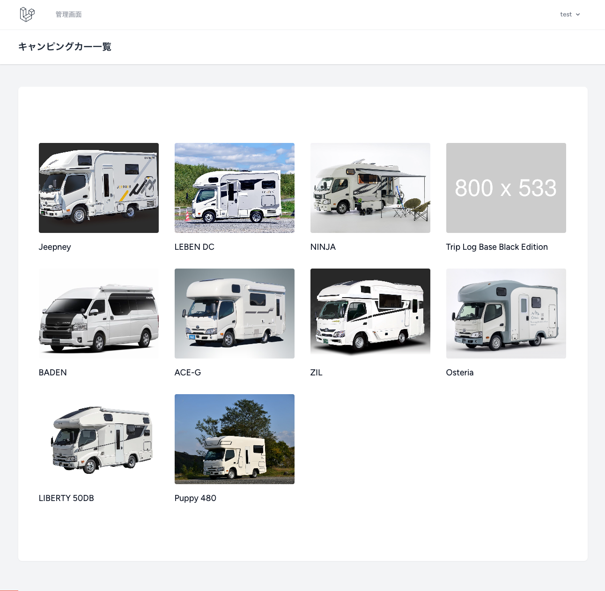
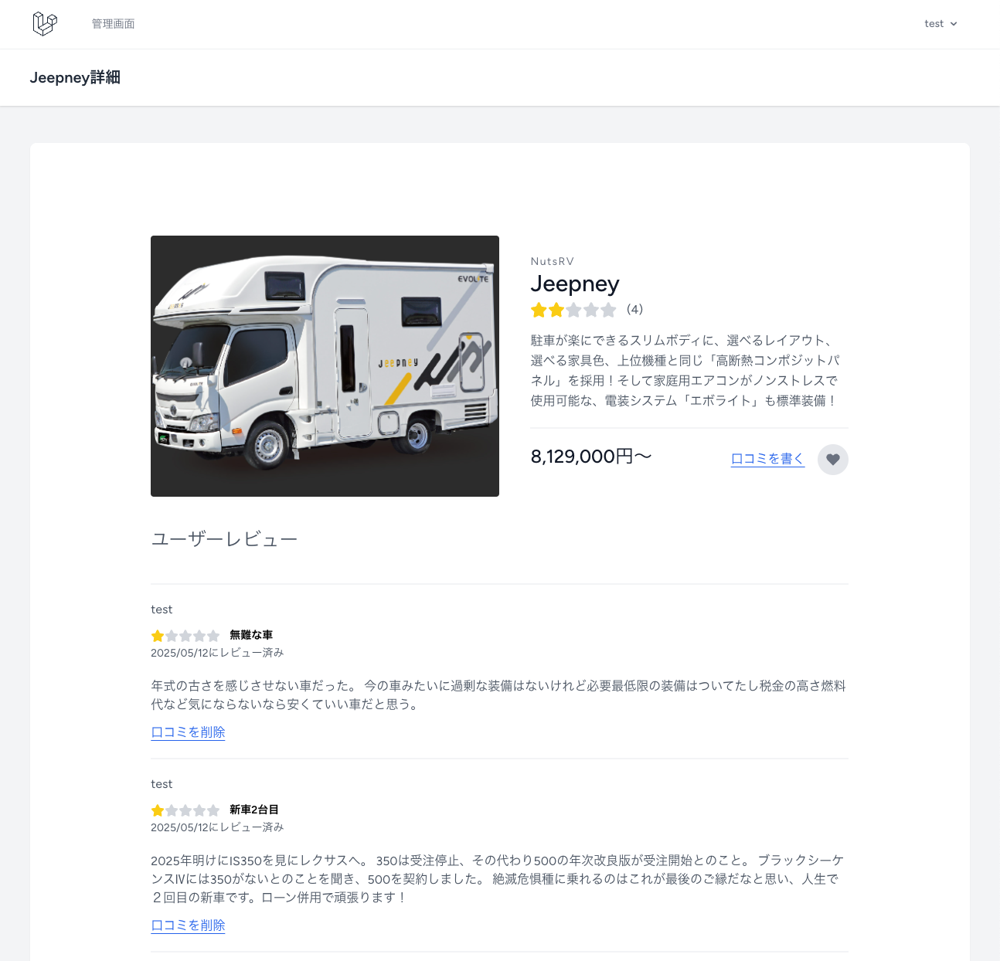

# 🚐 camcolle - キャンピングカーレビュー投稿アプリ

---

## 📄 概要 / Overview

**camcolle** は、Laravelを使用して開発したキャンピングカーのレビュー投稿アプリです。  
ログインユーザーがキャンピングカーに対する評価や感想を投稿・削除でき、ゲストユーザーでも一覧・詳細を閲覧することができます。  
Web開発の一連の流れと、レビュー投稿機能の実装を学ぶための学習用プロジェクトです。

> camcolle is a learning project built with Laravel, where users can post reviews about camping cars.  
> Guests can browse freely, while logged-in users can contribute and manage their own reviews.

---

## 🚀 学習したこと / What I Learned

- ✅ **Laravelによるレビュー投稿・削除機能**
  - 投稿はログインユーザー限定
  - 削除は投稿者本人のみ

- ✅ **ルートモデルバインディングとリレーションの活用**
  - carsテーブルとreviewsテーブルをリレーション
  - Car hasMany Reviews / Review belongsTo Car, belongsTo User

- ✅ **バリデーションとエラーメッセージ表示**
  - rating / title / comment の必須チェック

- ✅ **JavaScriptによる星評価UI**
  - SVGとTailwindを活用した5つ星インタラクション
  - `fill="currentColor"` と `text-yellow-400` を組み合わせた動的表示

- ✅ **Bladeでの条件分岐表示**
  - 投稿者のみ削除ボタン表示（`auth()->id() === $review->user_id`）

- ✅ **平均評価の算出とハーフスター表示**
  - 平均評価を計算し、半端な値もアイコンで可視化

---

## 🖥️ トップページ / Top Page

---

## 🖥️ 詳細ページ / Show Page

---

## 🛠 使用技術 / Technologies

- Laravel 10.48.29
- PHP 8.2.0
- Tailwind CSS
- Font Awesome SVG Icons
- JavaScript（星評価インタラクション用）
- Git / GitHub

---

## 👤 作者 / Author

- Shoma Inenaga  
- GitHub: [@CodeByShoma](https://github.com/CodeByShoma)

---

## 📄 ライセンス / License

このプロジェクトは MITライセンス のもとで公開されています。  
> This project is licensed under the MIT License.
